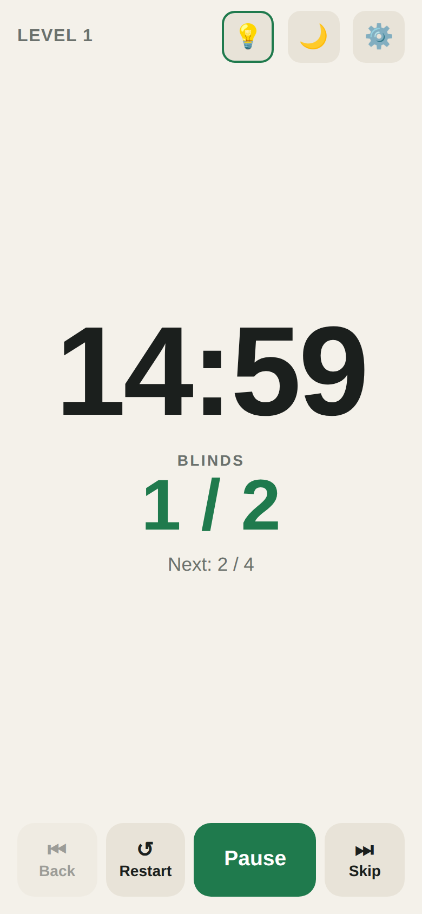
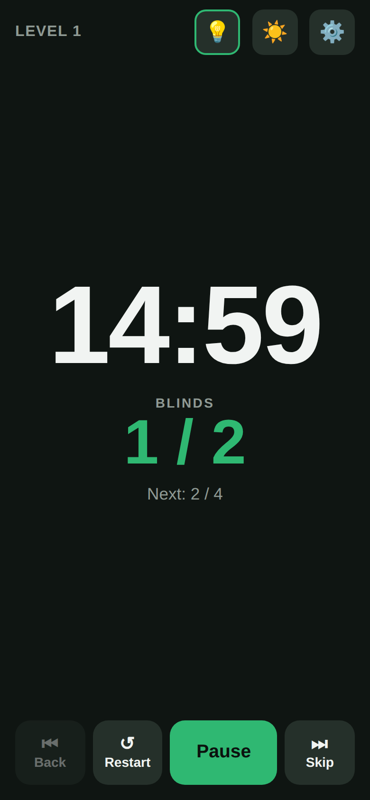
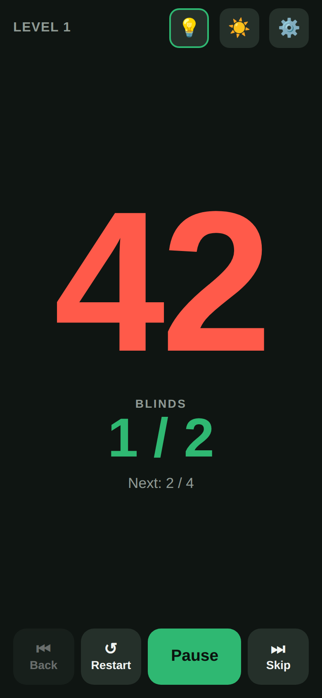
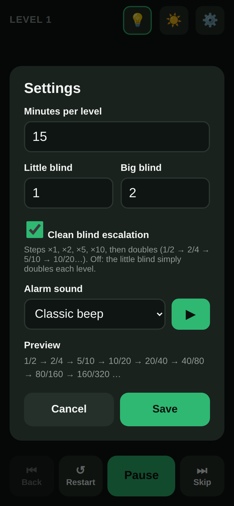

# ♠️ Poker Blinds Timer

A simple, phone-friendly blinds timer for home poker games. It's one self-contained HTML file with no install, no account and no internet connection needed once it's loaded. It works on iPhone, Android phones and tablets.

  
  
  
  

## Features

- **Large display:** a countdown and blinds readable from across the table, with a preview of the next level.
- **Final-minute countdown:** in the last 60 seconds the clock switches to extra-large red seconds (`60`, `59`, `58`…).
- **Automatic blind increases:** the big blind is always double the little blind, with two escalation styles (see below).
- **Alarm when time runs out:** pick from 8 alarm sounds, plus vibration on Android.
- **1-minute warning:** a soft double beep when a level has one minute left.
- **Level controls:** Back, Restart, Start/Pause/Resume and Skip.
- **Keeps the screen awake** so your phone doesn't lock mid-level.
- **Light and dark mode.**
- **Remembers your settings** on each device.
- **Portrait or landscape:** in landscape the timer and blinds sit side by side.

## Getting started

### Option 1: Host it on GitHub Pages (recommended)

1. Put `index.html` in a GitHub repository.
2. Go to **Settings → Pages**, set **Source** to *Deploy from a branch*, and choose your main branch and `/ (root)`.
3. After a minute, open `https://<your-username>.github.io/<repo-name>/` on your phone.

Hosting it gives the app a secure `https://` address, which lets the keep-awake feature and home-screen install work best.

### Option 2: Open the file directly

Copy `index.html` to your phone or tablet and open it in the browser. Everything works this way. Keep-awake falls back to a backup method (see [Keep screen awake](#keep-screen-awake)).

### Add it to your home screen

- **iPhone or iPad (Safari):** tap **Share → Add to Home Screen**.
- **Android (Chrome):** tap **⋮ → Add to Home screen** (or **Install app**).

It then opens full-screen like a regular app.

## Using the timer

### Main screen

| Control | What it does |
|---|---|
| **Start / Pause / Resume** | Starts or pauses the countdown for the current level. |
| **↺ Restart** | Resets the current level's clock to full time and pauses it. The level and blinds stay the same. |
| **⏮ Back** | Goes to the previous level and resets its clock. |
| **⏭ Skip** | Moves to the next level and resets its clock. |
| **💡** | Turns keep-screen-awake on or off. |
| **🌙 / ☀️** | Switches between light and dark mode. |
| **⚙️** | Opens Settings. |

### When a level ends

1. The alarm sounds and the screen flashes, showing the **new level and blinds**.
2. Tap **OK** to silence it. The alarm also stops on its own after 20 seconds.
3. The new level's full countdown is shown **paused**. Tap **Start** when the table is ready.

## Settings

Tap **⚙️** to open Settings.

| Setting | Default | Description |
|---|---|---|
| **Minutes per level** | 15 | Length of each blind level, from 1 to 180 minutes. |
| **Little blind** | 1 | Starting little blind. The big blind is set automatically to double this. |
| **Clean blind escalation** | On | Picks how blinds grow each level (see below). |
| **Alarm sound** | Classic beep | The sound played when a level ends. Tap **▶** to preview it. |

A **Preview** line shows the first eight levels so you can check the progression before saving.

Saving restarts the game at Level 1 **only if** you changed the minutes, the little blind or the escalation setting. Changing just the alarm sound won't interrupt a game in progress.

### Blind escalation

The big blind is always 2× the little blind. The checkbox controls how the little blind grows.

**Clean escalation (checked):** the blinds follow the familiar 1 → 2 → 5 → 10 steps, then double from there. The pattern scales from whatever starting blind you enter.

| Level | 1 | 2 | 3 | 4 | 5 | 6 | 7 | 8 |
|---|---|---|---|---|---|---|---|---|
| Start at 1 | 1/2 | 2/4 | 5/10 | 10/20 | 20/40 | 40/80 | 80/160 | 160/320 |
| Start at 25 | 25/50 | 50/100 | 125/250 | 250/500 | 500/1,000 | 1,000/2,000 | 2,000/4,000 | 4,000/8,000 |

**Straight doubling (unchecked):** the little blind doubles every level.

| Level | 1 | 2 | 3 | 4 | 5 | 6 | 7 | 8 |
|---|---|---|---|---|---|---|---|---|
| Start at 1 | 1/2 | 2/4 | 4/8 | 8/16 | 16/32 | 32/64 | 64/128 | 128/256 |
| Start at 25 | 25/50 | 50/100 | 100/200 | 200/400 | 400/800 | 800/1,600 | 1,600/3,200 | 3,200/6,400 |

### Alarm sounds

All sounds are generated in the browser, so there are no audio files to download.

| Sound | Description |
|---|---|
| **Classic beep** | Sharp two-tone alarm clock beeping. |
| **Bell / chime** | A ringing bell with a natural fade. Softer on the ears. |
| **Siren** | A rising and falling wail. Hard to miss in a noisy room. |
| **Casino ding** | Bright slot-machine style dings. |
| **Buzzer** | A low game-show buzzer. |
| **Country twang ("Blinds Up")** | An original banjo-style jingle with a boom-chick beat. |
| **Vegas lounge ("High Roller")** | An original swinging electric-piano jingle with walking bass. Mellow, so test it in a loud room. |
| **Cow moo** | A long, synthesized "mooooo." |

The alarm repeats until you tap **OK**, for up to 20 seconds.

## Keep screen awake

The **💡** button controls whether the screen stays on while the timer page is open, including while it's paused or between levels.

- **Outlined in green:** active. Your screen will stay on.
- **Dimmed:** it's on, but the phone hasn't allowed it yet. Tap anywhere on the screen to activate it.
- **Red slash:** turned off. Your screen will sleep normally.

How it works: the app uses the browser's standard Screen Wake Lock feature. If the browser doesn't support it or refuses (older iPhones, or opening the file directly instead of from a website), it falls back to playing a tiny silent, invisible video, which phones treat as "media playing" and won't sleep during.

## Tips and limitations

- **iPhone silent switch:** the silent switch (or Silent mode) mutes the alarm. Turn it off during a game, and turn up the volume.
- **iPhone Low Power Mode** may still dim or lock the screen. Turn it off during a game.
- **iPhone vibration:** iPhones don't allow web pages to vibrate, so only Android gets vibration.
- **Keep the app in front.** If you switch to another app, the countdown stays accurate, but the alarm may not sound until you come back.
- **Settings are saved per device and per browser.** Private or incognito windows may not remember them.

## Technical details

- One file (`index.html`) with HTML, CSS and plain JavaScript. There are no frameworks, build step or network requests.
- Sounds are synthesized with the Web Audio API.
- Settings are stored in the browser's `localStorage`.
- The countdown is based on the device clock, so it stays accurate even if the browser slows down background timers.

## License

Free to use under the [MIT License](LICENSE). You can use, copy, modify, share and even sell it. Just keep the license notice with any copies.

## Credits

The keep-awake fallback video is from [NoSleep.js](https://github.com/richtr/NoSleep.js) by Rich Tibbett, used under the MIT license.
